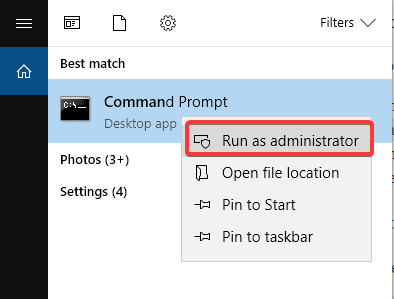

# Windows 10 Ubuntu dual boot not working Windows 10 Ubuntu dual boot not working [QUICK SOLUTIONS]
## Problem:
Windows 10 Ubuntu dual boot not working 


## Solution 01: Repair from Windows – Command Prompt

The simplest way to try to solve this issue is by using the Command Prompt from Windows. In order to do this, please use the steps described below:

1. In Windows go to menu and search for Command prompt
2. Right click on Command Prompt and choose the option **Run as administrator** 



3. Copy and paste (execute) the command:
```bcdedit /set {bootmgr} path EFIubuntugrubx64.eficommand prompt efi ubuntu```

4. Restart your computer.

**¡IMPORTANT! TRY SOLUTION 01 FIRST. if not works, after that try Solution 02.**

## Solution 2: Disable Fast Boot

You can also try to deactivate fast boot function of Windows 10 to access the GRUB menu. To do so, please follow the steps below:


1. Access `Control Panel`
2. Search for the term `power` in the search bar at the top right
3. Click on `Change what the power buttons do`

4. Click on the `Change settings currently unavailable` control panel power options

5. Uncheck the item `Turn on fast start up (recommended)`


Source:

<https://windowsreport.com/fix-dual-boot-windows-10-ubuntu/>\
<https://www.asus.com/support/FAQ/1045548/>