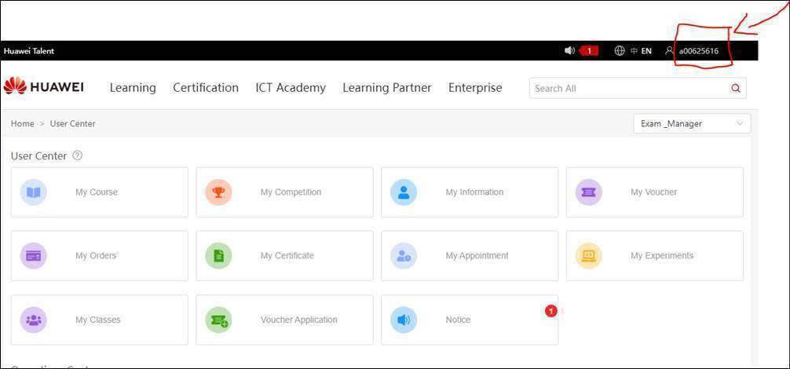
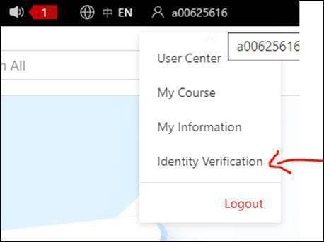

Estos son los pasos para solicitar el voucher para tu próxima examen HCIA.

## Obtener tu ID de Huawei: 

1. Entrar a la siguiente liga: https://e.huawei.com/en/talent/#/
2. El Huawei ID se encuentra de lado superior derecho de la pantalla. Ejemplo:

## Completar Identity Verification.

Llenar todos los campos requeridos. (Se puede utilizar identificaciones oficiales como INE, Pasaporte, Licencia de Conducir, etc).

## Fuente:
Asesor educativo Huawei México en vinculación con Trustnet-UAS.
